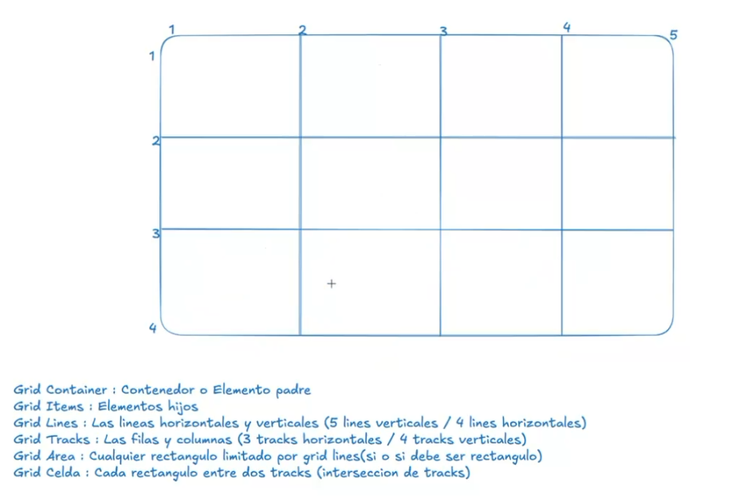

# FLEXBOX

- Layout model introducing W3C
- Incorporate the box concepts flexibles, content && pseudoelements
- Main and secondary axles (main axis %% cross axis)
-  Axles worked of left to right && top to bottom 

## FLEXBOX TERMINOLOGY 

- Flex container
- Flex items
- Main axis
- Cross axis
- Maint start
- Maint end

### MAIN AXIS

- Justify-content - Value : space-between || space-around || space-evenly || flex-start || flex-end || center
- space-between(X) Muestra elementos con la misma distancia entre ellos.
- space-around(X)  Muestra elementos con la misma separación alrededor de ellos.
- space-evenly(X)
- flex-start(X) Alinea elementos al lado izquierdo del contenedor.
- flex-end(X) Alinea elementos al lado derecho del contenedor.
- center(X) Alinea elementos en el centro del contenedor.

### CROSS AXIS

- Align items - Value: flex-start || flex-end || center
- flex-start: Alinea elementos a la parte superior del contenedor.
- flex-end: Alinea elementos a la parte inferior del contenedor.
- center: Alinea elementos en el centro (verticalmente hablando) del contenedor.
- baseline: Muestra elementos en la línea base del contenedor
- stretch: Elementos se estiran para ajustarse al contenedor.

### CHANGE AXIS

- flex-direction
- row: Elementos son colocados en la misma dirección del texto.
- row-reverse: Elementos son colocados en la dirección opuesta al texto.
- column: Elementos se colocan de arriba hacia abajo.
- column-reverse: Elementos se colocan de abajo hacia arriba.